# Cybernara Backend Architecture

Snapshot date: 2026-07-03  
OpenAPI version: `0.1.0-m0`  
Current API surface: 92 paths, 120 operations  
Current schema audit: 58 expected tables found, 21 expected indexes found, 58 RLS-enabled tables/policies found, 1 trigger found, 1 function found, 0 unexpected diffs

This document describes the backend as it exists now. It is based on the current source under `src/`, migrations under `supabase/migrations/`, `openapi/cybernara.openapi.json`, `docs/checkpoints/`, `docs/traceability-matrix.md`, and the current `node scripts/schema-audit.mjs` result.

## 1. System Overview

Cybernara is a private-cloud, multi-framework GRC and privacy compliance platform. The backend is implemented as a NestJS modular monolith rather than as independently deployed services: modules keep their own domain/application/infrastructure/presentation boundaries, while the process and database are shared. This choice matches the current ADRs: `docs/adr/0001-data-access.md` standardizes direct `pg` access for authoritative repositories, `docs/adr/0002-supabase-phase-infra.md` records Supabase as the current infrastructure phase, and `docs/adr/0003-openapi-repo-boundary.md` makes the OpenAPI artifact the only supported frontend/backend integration boundary.

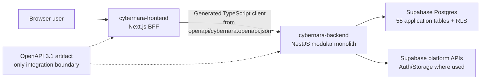

## 2. Module Inventory

The full route list is in Section 5. Route counts below are derived from the current OpenAPI tags. `Root` and `Health` are app-level controllers and are not modules under `src/modules/`.

### IdentityTenant

Responsibility: tenant registration and tenant lookup through the `identity_tenants` table. The migration also defines users, roles, grants, sessions, service accounts, and workspace delegation tables, but the current HTTP surface only exposes tenant creation and retrieval.

Layers present: `domain/`, `application/`, `infrastructure/`, `presentation/`.

Public surface: `src/modules/identity-tenant/public.ts` exports the tenant domain types/functions and `IdentityTenantService`.

Migration ownership: `supabase/migrations/0001_m0_foundations.sql`.

Routes: 2, listed in Section 5.

### AuditSecurity

Responsibility: append and read immutable audit events. The domain and repository maintain a hash chain; the migration adds a trigger/function that prevents audit row mutation.

Layers present: `domain/`, `application/`, `infrastructure/`, `presentation/`.

Public surface: `src/modules/audit-security/public.ts` exports `AuditSecurityModule`, `AuditLogService`, audit event types, and audit verification helpers.

Migration ownership: `supabase/migrations/0001_m0_foundations.sql`.

Routes: 2, listed in Section 5.

### Outbox

Responsibility: persist idempotent outbox events and support worker dispatch state. Application services use it to make mutation side effects replay-safe.

Layers present: `domain/`, `application/`, `infrastructure/`, `presentation/`, plus `worker/`.

Public surface: `src/modules/outbox/public.ts` exports `OutboxModule`, `OutboxService`, and `OutboxEvent`.

Migration ownership: `supabase/migrations/0001_m0_foundations.sql`.

Routes: 1, listed in Section 5.

### FrameworkContent

Responsibility: parse, persist, and browse framework content source packages, content packs, requirements, and rejected ingestion records. The application service wires ExcelJS adapters to a transactional repository publish path.

Layers present: `domain/`, `application/`, `infrastructure/`, `presentation/`, and `cli/`.

Public surface: `src/modules/framework-content/public.ts` exports `ContentIngestionService`, framework content repository interfaces/results, and workbook content types.

Migration ownership: `supabase/migrations/0002_m1_framework_content.sql`.

Routes: 7, listed in Section 5.

Known deferrals in this area: custom framework authoring (`FRM-05`) and full regulatory-change impact queues (`FRM-06`, `PRD-10`) remain deferred in `docs/traceability-matrix.md`.

### Harmonization

Responsibility: persist and browse the harmonized control library, mappings from framework requirements to harmonized controls, and framework-specific unique-control views.

Layers present: `domain/`, `application/`, `infrastructure/`, `presentation/`.

Public surface: `src/modules/harmonization/public.ts` exports harmonization workbook adapters, `HarmonizationService`, repository contracts, and harmonization domain types.

Migration ownership: `supabase/migrations/0002_m1_framework_content.sql`.

Routes: 5, listed in Section 5.

### Assessment

Responsibility: create assessment scopes from pinned controls and enforce the item/assessment workflow: not started, in progress, submitted, needs changes, approved, and closed.

Layers present: `domain/`, `application/`, `infrastructure/`, `presentation/`.

Public surface: `src/modules/assessment/public.ts` exports `AssessmentModule`, `AssessmentService`, repository record/contracts, assessment domain types, and the domain workflow functions.

Migration ownership: `supabase/migrations/0003_m2_assessment_core.sql`.

Routes: 10, listed in Section 5.

Known deferral: the external auditor portal, expiring access, request lists, annotations, and controlled downloads remain deferred under `ASM-07`.

### EvidenceAssurance

Responsibility: manage evidence objects through pending, quarantined, committed, and rejected states, including scan status and reuse checks against sufficiency/staleness rules.

Layers present: `domain/`, `application/`, `infrastructure/`, `presentation/`.

Public surface: `src/modules/evidence-assurance/public.ts` exports `EvidenceAssuranceModule`, `EvidenceAssuranceService`, evidence domain types, and evidence workflow functions.

Migration ownership: `supabase/migrations/0003_m2_assessment_core.sql`.

Routes: 7, listed in Section 5.

Known deferral: evidence request campaigns, reminders, comments, approvals, and completion dashboards remain deferred under `EVD-06`.

### RiskWorkflow

Responsibility: create and update findings and remediation tasks, and model risk acceptance as a real, independently reviewable record rather than a bare status flag.

Layers present: `domain/`, `application/`, `infrastructure/`, `presentation/`.

Public surface: `src/modules/risk-workflow/public.ts` exports `RiskWorkflowModule`, `RiskWorkflowService`, risk domain types/functions (including `createRiskAcceptance`, `isRiskAcceptanceActive`, `reviewRiskAcceptance`), and repository contracts.

Migration ownership: `supabase/migrations/0003_m2_assessment_core.sql` (findings/remediation_tasks), `supabase/migrations/0009_g02_g05_integrity_and_catalog_scope.sql` (`findings.assessment_item_id` foreign key), `supabase/migrations/0010_g03_risk_acceptances.sql` (`risk_acceptances`, `risk_acceptance_reviews`).

Routes: 11, listed in Section 5 (`GET`/`POST` risk-acceptance and `POST` risk-acceptance reviews added by the G-03 schema remediation pass).

Schema remediation (G-02, G-03 — see Section 12): `remediation_tasks.status = 'risk_accepted'` used to be the *only* record of a risk acceptance, with the approver/reason/expiry carried solely as an audit/outbox side channel and never queryable back; `findings.assessment_item_id` had no foreign key at all. Both gaps are now closed: `findings.assessment_item_id` is FK-enforced (`NOT VALID` → `VALIDATE` pattern, orphans reconciled first), and a real `risk_acceptances` row (approver, rationale, expiry, next review date, optional compensating controls) is created transactionally alongside the status flip via `RiskWorkflowService.acceptRisk`, with `risk_acceptance_reviews` recording an append-only history of periodic re-justifications. `risk_acceptances.remediation_task_id`/`finding_id` are a deliberate scoping decision in place of the schema spec's `risk_id` (§12), which points at an enterprise risk register (`risks`, tracked as G-09) that does not exist in this schema yet — see `docs/schema-remediation-report.md` for the full reasoning and the deferred `risk_id` migration path.

### ReportingAnalytics

Responsibility: request, track, and download PDF/XLSX report exports for frozen assessment snapshots.

Layers present: `domain/`, `application/`, `infrastructure/`, `presentation/`.

Public surface: `src/modules/reporting-analytics/public.ts` exports `ReportingAnalyticsModule`, `ReportingAnalyticsService`, report rendering/idempotency functions, domain types, and repository contracts.

Migration ownership: `supabase/migrations/0003_m2_assessment_core.sql`.

Routes: 4, listed in Section 5.

Schema compromise: `report_exports` stores export metadata, storage URI, and SHA-256 hash, not artifact bytes. Downloads re-render deterministically from the pinned assessment snapshot and verify the hash.

Known deferrals: broader reporting dashboards and scheduled delivery remain deferred under `PRD-09`, `RPT-02`, and `RPT-03`.

### AIOrchestration

Responsibility: govern AI question generation, provenance, fallback, human review, and publish eligibility.

Layers present: `domain/`, `application/`, `infrastructure/`, `presentation/`.

Public surface: `src/modules/ai-orchestration/public.ts` exports `AiOrchestrationModule`, `AiOrchestrationService`, repository records/contracts, and AI governance/generation domain functions.

Migration ownership: `supabase/migrations/0004_m3_ai_orchestration.sql`.

Routes: 6, listed in Section 5.

Known deferrals: broader advisory assistants, questionnaire automation, and standalone model/prompt promotion APIs remain deferred under `AI-05`, `AI-06`, and part of `AI-08`.

### IntegrationPlatform

Responsibility: register connectors, record sync runs and connector objects, register webhook contracts, record deliveries, track automated control tests, and list assurance alerts.

Layers present: `domain/`, `application/`, `infrastructure/`, `presentation/`.

Public surface: `src/modules/integration-platform/public.ts` exports `IntegrationPlatformService`, integration record/repository types, and connector/webhook/control-test/alert domain functions.

Migration ownership: `supabase/migrations/0005_m4_integration_platform.sql`.

Routes: 14, listed in Section 5.

### PrivacyOperations

Responsibility: expose privacy inventory, RoPA processing activities, DPIAs, rights-request workflow steps, consent grant/withdrawal, incidents, and retention/legal-hold evaluation.

Layers present: `domain/`, `application/`, `infrastructure/`, `presentation/`.

Public surface: `src/modules/privacy-operations/public.ts` exports `PrivacyOperationsService`, repository row types, and privacy domain functions/types.

Migration ownership: `supabase/migrations/0006_m5_privacy_enterprise_grc.sql`.

Routes: 26, listed in Section 5.

Schema shape note: several relationships are stored as UUID arrays or JSON fields rather than normalized child tables.

### EnterpriseGRC

Responsibility: expose policy, access review, vendor, audit engagement, trust-center artifact, workspace, and custom-object-definition workflows.

Layers present: `domain/`, `application/`, `infrastructure/`, `presentation/`.

Public surface: `src/modules/enterprise-grc/public.ts` exports `EnterpriseGrcService`, repository row types, and enterprise GRC domain functions/types.

Migration ownership: `supabase/migrations/0006_m5_privacy_enterprise_grc.sql`.

Routes: 24, listed in Section 5.

Schema shape note: questionnaires, monitoring, contract, request, and remediation references are stored as ID arrays or JSON fields rather than separate normalized tables.

### PlatformHardening

Responsibility: provide the policy engine and platform hardening domain foundations used across the API: policy decisions, rate-limit policy metadata, idempotency-key helpers, signed export manifests, key records, SIEM export records, backup/restore records, product-assurance evidence, SDLC release gates, and upload-clean gates.

Layers present: `domain/` and `application/`. There is no `infrastructure/` or `presentation/` folder because this module currently has no repository-backed API surface. It is consumed through the policy guard/decorator and domain exports.

Public surface: `src/modules/platform-hardening/public.ts` exports `PlatformHardeningModule`, `RequirePolicy`, `PolicyGuard`, and hardening domain functions/types.

Migration ownership: `supabase/migrations/0007_m6_platform_hardening.sql`.

Routes: 0.

Known deferrals: standalone administration routes for rate limits, key administration, backups, evidence administration, and release administration remain deferred under `BE-07`, `SEC-02`, `SEC-04`, `SEC-05`, and `SEC-06`.

## 3. Layered Architecture Pattern

The backend uses a consistent domain -> application -> infrastructure -> presentation pattern. A mature example is `src/modules/assessment/`: `domain/assessment.ts` contains workflow invariants, `application/assessment.service.ts` coordinates repository calls plus outbox/audit effects, `infrastructure/postgres-assessment.repository.ts` maps records to Postgres, and `presentation/assessment.controller.ts` exposes validated NestJS routes. M0 modules such as `identity-tenant`, `audit-security`, and `outbox` follow the same layering.

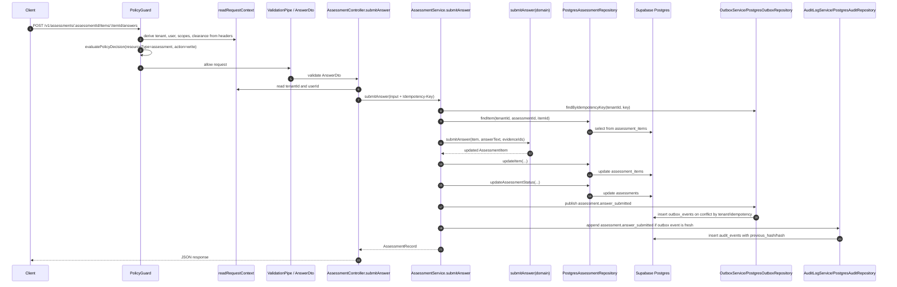

Module imports are also structured. The diagram below is derived from current Nest module imports rather than from desired architecture:

```mermaid
graph TD
  AiOrchestrationModule --> DatabaseModule
  AiOrchestrationModule --> AuditSecurityModule
  AiOrchestrationModule --> OutboxModule
  AiOrchestrationModule --> PlatformHardeningModule
  AssessmentModule --> DatabaseModule
  AssessmentModule --> AuditSecurityModule
  AssessmentModule --> OutboxModule
  AssessmentModule --> PlatformHardeningModule
  AuditSecurityModule --> DatabaseModule
  EnterpriseGrcModule --> DatabaseModule
  EnterpriseGrcModule --> AuditSecurityModule
  EnterpriseGrcModule --> OutboxModule
  EnterpriseGrcModule --> PlatformHardeningModule
  EvidenceAssuranceModule --> DatabaseModule
  EvidenceAssuranceModule --> AuditSecurityModule
  EvidenceAssuranceModule --> OutboxModule
  EvidenceAssuranceModule --> PlatformHardeningModule
  FrameworkContentModule --> DatabaseModule
  FrameworkContentModule --> AuditSecurityModule
  FrameworkContentModule --> OutboxModule
  FrameworkContentModule --> PlatformHardeningModule
  HarmonizationModule --> DatabaseModule
  HarmonizationModule --> PlatformHardeningModule
  IdentityTenantModule --> DatabaseModule
  IdentityTenantModule --> SupabaseModule
  IntegrationPlatformModule --> DatabaseModule
  IntegrationPlatformModule --> AuditSecurityModule
  IntegrationPlatformModule --> OutboxModule
  IntegrationPlatformModule --> PlatformHardeningModule
  OutboxModule --> DatabaseModule
  PrivacyOperationsModule --> DatabaseModule
  PrivacyOperationsModule --> AuditSecurityModule
  PrivacyOperationsModule --> OutboxModule
  PrivacyOperationsModule --> PlatformHardeningModule
  ReportingAnalyticsModule --> DatabaseModule
  ReportingAnalyticsModule --> AssessmentModule
  ReportingAnalyticsModule --> AuditSecurityModule
  ReportingAnalyticsModule --> OutboxModule
  ReportingAnalyticsModule --> PlatformHardeningModule
  RiskWorkflowModule --> DatabaseModule
  RiskWorkflowModule --> AuditSecurityModule
  RiskWorkflowModule --> OutboxModule
  RiskWorkflowModule --> PlatformHardeningModule
```

`scripts/check-boundaries.mjs` enforces module boundaries by scanning relative imports under `src/modules/`. A module may import another module only through that module's `public.ts`; imports into another module's internal domain/application/infrastructure/presentation files are reported as violations. This keeps cross-module contracts explicit while still allowing Nest module composition.

## 4. Cross-Cutting Platform Concerns

### Authorization

Authorization is implemented by `src/modules/platform-hardening/application/policy.guard.ts` and `policy.decorator.ts`. Controllers opt in with `@UseGuards(PolicyGuard)` and per-route `@RequirePolicy({ resourceType, action, resourceIdParam })`. `readRequestContext` in `src/shared/request-context.ts` derives `tenantId`, `userId`, `roles`, `scopes`, `clearance`, and correlation IDs from headers such as `x-tenant-id`, `x-user-id`, `x-user-scopes`, and `x-user-clearance`. The policy engine in `src/modules/platform-hardening/domain/hardening.ts` denies by default when tenant, clearance, or scope checks fail. Supabase RLS is present on every application table and is an independent database layer, not a replacement for the policy guard.

The root status endpoint `GET /` and health endpoint `GET /v1/health` are not tenant-scoped and are intentionally ungated.

### Idempotency

Mutating API-exposure endpoints require an `Idempotency-Key` header when the operation is modeled as replay-safe. Services first look up an existing outbox event by tenant and idempotency key or rely on the outbox repository's `(tenant_id, idempotency_key)` conflict behavior. If a previous event exists, services return the previously affected resource instead of creating duplicate side effects. The original M0 audit/outbox endpoints keep their own M0 contracts; the A1-A8 module mutations use the `Idempotency-Key` convention consistently.

### Outbox And Audit

The outbox pattern is implemented by `OutboxService` and `PostgresOutboxRepository`. Mutation services publish domain events with aggregate metadata and an idempotency key. The repository writes to `outbox_events`, and the worker under `src/modules/outbox/worker/` can claim and mark events processed or failed.

Audit logging is implemented by `AuditLogService` and `PostgresAuditRepository`. Each event includes a previous hash and a current SHA-256 hash over a canonical JSON payload. `0001_m0_foundations.sql` creates the immutable audit trigger/function, and `test/audit-security/hash-chain.test.ts` verifies hash-chain behavior.

### Error Contract

`src/shared/problem-details.filter.ts` is registered globally in `src/main.ts`. It returns a uniform problem-details JSON shape with `type`, `title`, `status`, `detail`, `instance`, and `correlationId`. Controllers do not define a second error envelope.

### AI Governance Invariant

AI-origin question publishing is guarded at the API/application layer, not only in domain tests. `AiOrchestrationService.publishQuestion` rejects publish unless the question is already approved, the generation status is approved, and `approvedBy` is present. The HTTP route `POST /v1/ai-orchestration/questions/{questionId}/publish` is covered by `test/ai-orchestration/a5-ai-api.test.ts`, including the invariant that AI-origin content cannot be published without prior human approval.

## 5. Complete API Surface

The table below is regenerated from `openapi/cybernara.openapi.json`. The OpenAPI spec currently has 92 paths and 120 operations.

| Method | Path | Module |
|---|---|---|
| GET | `/` | Root |
| GET | `/v1/health` | Health |
| POST | `/v1/identity/tenants` | IdentityTenant |
| GET | `/v1/identity/tenants/{tenantId}` | IdentityTenant |
| POST | `/v1/audit/events` | AuditSecurity |
| GET | `/v1/audit/events/{eventId}` | AuditSecurity |
| POST | `/v1/outbox/events` | Outbox |
| POST | `/v1/framework-content/ingestion-runs` | FrameworkContent |
| GET | `/v1/framework-content/source-packages` | FrameworkContent |
| GET | `/v1/framework-content/content-packs` | FrameworkContent |
| GET | `/v1/framework-content/content-packs/{packId}` | FrameworkContent |
| GET | `/v1/framework-content/content-packs/{packId}/requirements` | FrameworkContent |
| GET | `/v1/framework-content/requirements` | FrameworkContent |
| GET | `/v1/framework-content/rejected-records` | FrameworkContent |
| GET | `/v1/harmonization/controls` | Harmonization |
| GET | `/v1/harmonization/controls/{harmonizedId}` | Harmonization |
| GET | `/v1/harmonization/controls/{harmonizedId}/mappings` | Harmonization |
| GET | `/v1/harmonization/frameworks/{frameworkKey}/mappings` | Harmonization |
| GET | `/v1/harmonization/frameworks/{frameworkKey}/unique-controls` | Harmonization |
| GET | `/v1/assessments` | Assessment |
| POST | `/v1/assessments` | Assessment |
| GET | `/v1/assessments/{assessmentId}` | Assessment |
| GET | `/v1/assessments/{assessmentId}/items` | Assessment |
| GET | `/v1/assessments/{assessmentId}/items/{itemId}` | Assessment |
| POST | `/v1/assessments/{assessmentId}/items/{itemId}/applicability` | Assessment |
| POST | `/v1/assessments/{assessmentId}/items/{itemId}/answers` | Assessment |
| POST | `/v1/assessments/{assessmentId}/items/{itemId}/reviews` | Assessment |
| POST | `/v1/assessments/{assessmentId}/items/{itemId}/reopen` | Assessment |
| POST | `/v1/assessments/{assessmentId}/close` | Assessment |
| GET | `/v1/evidence/objects` | EvidenceAssurance |
| POST | `/v1/evidence/objects` | EvidenceAssurance |
| GET | `/v1/evidence/objects/{evidenceId}` | EvidenceAssurance |
| GET | `/v1/evidence/objects/{evidenceId}/scan-status` | EvidenceAssurance |
| POST | `/v1/evidence/objects/{evidenceId}/quarantine` | EvidenceAssurance |
| POST | `/v1/evidence/objects/{evidenceId}/commit` | EvidenceAssurance |
| POST | `/v1/evidence/objects/{evidenceId}/reuse-check` | EvidenceAssurance |
| GET | `/v1/risk-workflow/findings` | RiskWorkflow |
| POST | `/v1/risk-workflow/findings` | RiskWorkflow |
| GET | `/v1/risk-workflow/findings/{findingId}` | RiskWorkflow |
| PATCH | `/v1/risk-workflow/findings/{findingId}` | RiskWorkflow |
| GET | `/v1/risk-workflow/remediation-tasks` | RiskWorkflow |
| POST | `/v1/risk-workflow/remediation-tasks` | RiskWorkflow |
| GET | `/v1/risk-workflow/remediation-tasks/{taskId}` | RiskWorkflow |
| PATCH | `/v1/risk-workflow/remediation-tasks/{taskId}` | RiskWorkflow |
| POST | `/v1/risk-workflow/remediation-tasks/{taskId}/risk-acceptance` | RiskWorkflow |
| GET | `/v1/risk-workflow/remediation-tasks/{taskId}/risk-acceptance` | RiskWorkflow |
| POST | `/v1/risk-workflow/remediation-tasks/{taskId}/risk-acceptance/reviews` | RiskWorkflow |
| GET | `/v1/report-exports` | ReportingAnalytics |
| POST | `/v1/report-exports` | ReportingAnalytics |
| GET | `/v1/report-exports/{exportId}` | ReportingAnalytics |
| GET | `/v1/report-exports/{exportId}/download` | ReportingAnalytics |
| POST | `/v1/ai-orchestration/question-generations` | AIOrchestration |
| POST | `/v1/ai-orchestration/question-generations/fallback` | AIOrchestration |
| GET | `/v1/ai-orchestration/questions/pending-review` | AIOrchestration |
| GET | `/v1/ai-orchestration/question-generations/{generationRunId}/provenance` | AIOrchestration |
| POST | `/v1/ai-orchestration/question-generations/{generationRunId}/reviews` | AIOrchestration |
| POST | `/v1/ai-orchestration/questions/{questionId}/publish` | AIOrchestration |
| GET | `/v1/integration-platform/connectors` | IntegrationPlatform |
| POST | `/v1/integration-platform/connectors` | IntegrationPlatform |
| GET | `/v1/integration-platform/connectors/{connectorId}` | IntegrationPlatform |
| GET | `/v1/integration-platform/connectors/{connectorId}/sync-runs` | IntegrationPlatform |
| POST | `/v1/integration-platform/connectors/{connectorId}/sync-runs` | IntegrationPlatform |
| GET | `/v1/integration-platform/connectors/{connectorId}/objects` | IntegrationPlatform |
| POST | `/v1/integration-platform/connectors/{connectorId}/objects` | IntegrationPlatform |
| GET | `/v1/integration-platform/webhook-contracts` | IntegrationPlatform |
| POST | `/v1/integration-platform/webhook-contracts` | IntegrationPlatform |
| GET | `/v1/integration-platform/webhook-contracts/{webhookId}/deliveries` | IntegrationPlatform |
| POST | `/v1/integration-platform/webhook-contracts/{webhookId}/deliveries` | IntegrationPlatform |
| GET | `/v1/integration-platform/control-tests` | IntegrationPlatform |
| POST | `/v1/integration-platform/control-tests` | IntegrationPlatform |
| GET | `/v1/integration-platform/assurance-alerts` | IntegrationPlatform |
| GET | `/v1/privacy-operations/inventory-records` | PrivacyOperations |
| POST | `/v1/privacy-operations/inventory-records` | PrivacyOperations |
| GET | `/v1/privacy-operations/inventory-records/{recordId}` | PrivacyOperations |
| GET | `/v1/privacy-operations/processing-activities` | PrivacyOperations |
| POST | `/v1/privacy-operations/processing-activities` | PrivacyOperations |
| GET | `/v1/privacy-operations/processing-activities/{activityId}` | PrivacyOperations |
| GET | `/v1/privacy-operations/dpia-assessments` | PrivacyOperations |
| POST | `/v1/privacy-operations/dpia-assessments` | PrivacyOperations |
| GET | `/v1/privacy-operations/dpia-assessments/{dpiaId}` | PrivacyOperations |
| GET | `/v1/privacy-operations/rights-requests` | PrivacyOperations |
| POST | `/v1/privacy-operations/rights-requests` | PrivacyOperations |
| GET | `/v1/privacy-operations/rights-requests/{requestId}` | PrivacyOperations |
| POST | `/v1/privacy-operations/rights-requests/{requestId}/verify-identity` | PrivacyOperations |
| POST | `/v1/privacy-operations/rights-requests/{requestId}/search-tasks` | PrivacyOperations |
| POST | `/v1/privacy-operations/rights-requests/{requestId}/complete` | PrivacyOperations |
| GET | `/v1/privacy-operations/consents` | PrivacyOperations |
| POST | `/v1/privacy-operations/consents` | PrivacyOperations |
| GET | `/v1/privacy-operations/consents/{consentId}` | PrivacyOperations |
| POST | `/v1/privacy-operations/consents/{consentId}/withdraw` | PrivacyOperations |
| GET | `/v1/privacy-operations/incidents` | PrivacyOperations |
| POST | `/v1/privacy-operations/incidents` | PrivacyOperations |
| GET | `/v1/privacy-operations/incidents/{incidentId}` | PrivacyOperations |
| GET | `/v1/privacy-operations/retention-schedules` | PrivacyOperations |
| POST | `/v1/privacy-operations/retention-schedules` | PrivacyOperations |
| GET | `/v1/privacy-operations/retention-schedules/{scheduleId}` | PrivacyOperations |
| GET | `/v1/privacy-operations/retention-schedules/{scheduleId}/evaluation` | PrivacyOperations |
| GET | `/v1/enterprise-grc/policies` | EnterpriseGRC |
| POST | `/v1/enterprise-grc/policies` | EnterpriseGRC |
| GET | `/v1/enterprise-grc/policies/{policyId}` | EnterpriseGRC |
| POST | `/v1/enterprise-grc/policies/{policyId}/publish` | EnterpriseGRC |
| POST | `/v1/enterprise-grc/policies/{policyId}/exceptions` | EnterpriseGRC |
| GET | `/v1/enterprise-grc/access-reviews` | EnterpriseGRC |
| POST | `/v1/enterprise-grc/access-reviews` | EnterpriseGRC |
| GET | `/v1/enterprise-grc/access-reviews/{reviewId}` | EnterpriseGRC |
| GET | `/v1/enterprise-grc/vendors` | EnterpriseGRC |
| POST | `/v1/enterprise-grc/vendors` | EnterpriseGRC |
| GET | `/v1/enterprise-grc/vendors/{vendorId}` | EnterpriseGRC |
| GET | `/v1/enterprise-grc/audit-engagements` | EnterpriseGRC |
| POST | `/v1/enterprise-grc/audit-engagements` | EnterpriseGRC |
| GET | `/v1/enterprise-grc/audit-engagements/{engagementId}` | EnterpriseGRC |
| GET | `/v1/enterprise-grc/trust-center-artifacts` | EnterpriseGRC |
| POST | `/v1/enterprise-grc/trust-center-artifacts` | EnterpriseGRC |
| GET | `/v1/enterprise-grc/trust-center-artifacts/{artifactId}` | EnterpriseGRC |
| POST | `/v1/enterprise-grc/trust-center-artifacts/{artifactId}/downloads` | EnterpriseGRC |
| GET | `/v1/enterprise-grc/workspaces` | EnterpriseGRC |
| POST | `/v1/enterprise-grc/workspaces` | EnterpriseGRC |
| GET | `/v1/enterprise-grc/workspaces/{workspaceId}` | EnterpriseGRC |
| GET | `/v1/enterprise-grc/custom-object-definitions` | EnterpriseGRC |
| POST | `/v1/enterprise-grc/custom-object-definitions` | EnterpriseGRC |
| GET | `/v1/enterprise-grc/custom-object-definitions/{definitionId}` | EnterpriseGRC |

Two API conventions are load-bearing in the current implementation:

1. Most resources are create-and-read focused. Mutations are exposed as explicit domain-modeled transitions such as `reopen`, `close`, `commit`, `withdraw`, `complete`, or `publish`; generic update/delete endpoints exist only where the domain and schema explicitly support them.
2. List endpoints use offset pagination through `PaginationQueryDto` and `toPagination`: `limit` defaults to 50, maxes at 500, and `offset` defaults to 0.

## 6. Database Schema

The current schema is owned by seven migrations. The live schema audit confirms all expected objects exist in the configured Supabase target.

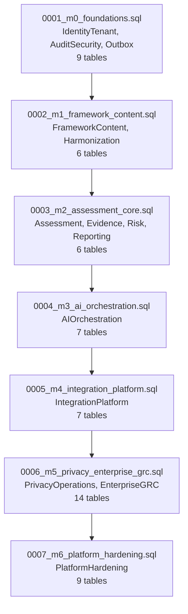

### M0 Foundations ERD

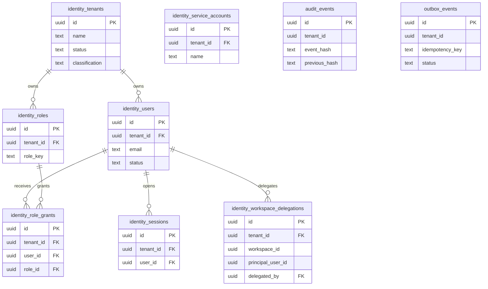

### M1 Framework Content And Harmonization ERD

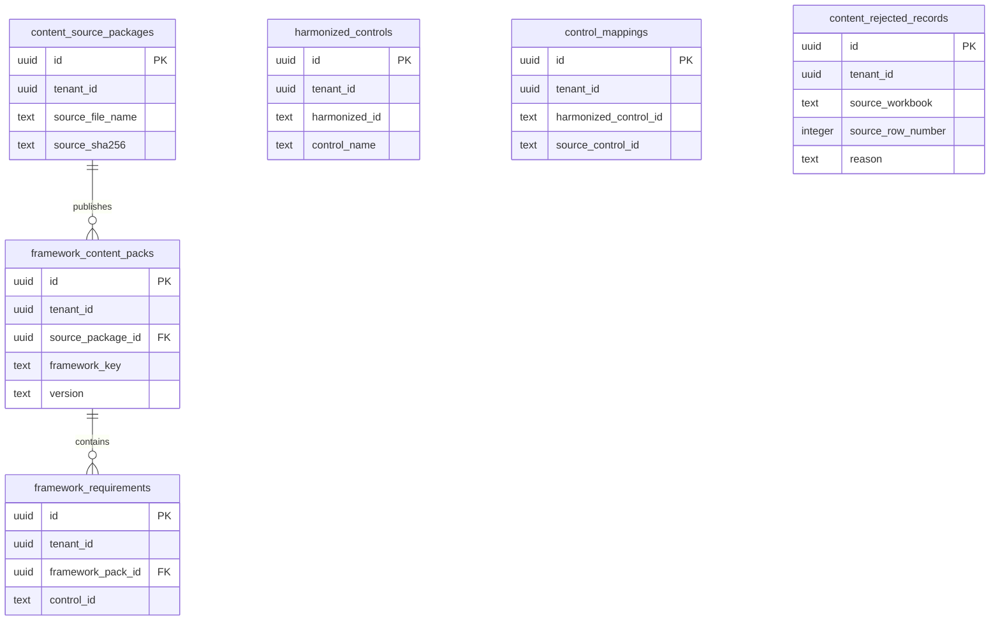

### M2 Assessment, Evidence, Risk, And Reporting ERD

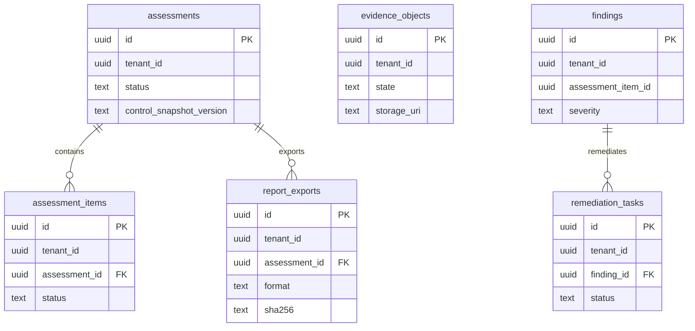

### M3 AI Orchestration ERD

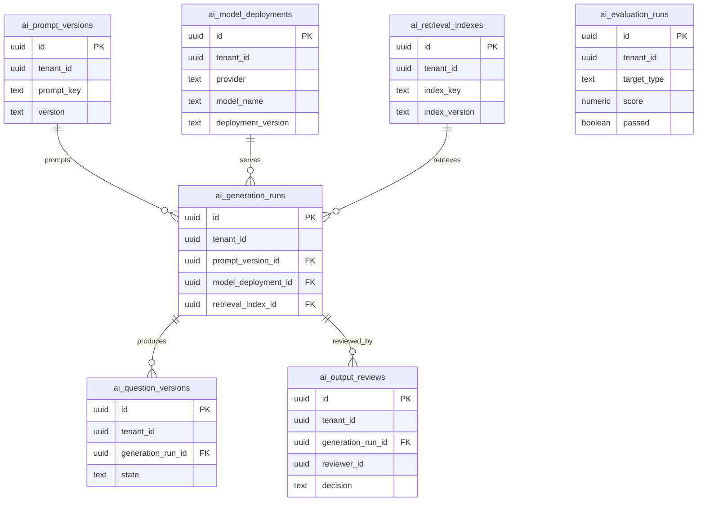

### M4 Integration Platform ERD

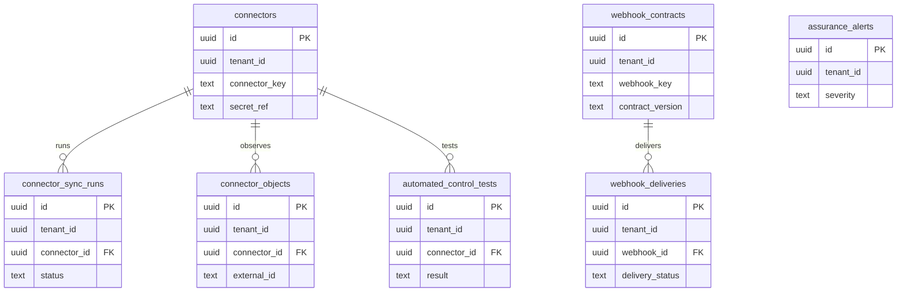

### M5 Privacy And Enterprise GRC ERD

```mermaid
erDiagram
  data_inventory_records {
    uuid id PK
    uuid tenant_id
    text system_name
  }
  processing_activities {
    uuid id PK
    uuid tenant_id
    uuid_array inventory_record_ids
  }
  dpia_assessments {
    uuid id PK
    uuid tenant_id
    uuid processing_activity_id
  }
  privacy_rights_requests {
    uuid id PK
    uuid tenant_id
    text status
  }
  consent_records {
    uuid id PK
    uuid tenant_id
    text status
  }
  privacy_incidents {
    uuid id PK
    uuid tenant_id
    text severity
  }
  retention_schedules {
    uuid id PK
    uuid tenant_id
    integer retention_months
    boolean legal_hold
  }
  policy_versions {
    uuid id PK
    uuid tenant_id
    text status
  }
  access_reviews {
    uuid id PK
    uuid tenant_id
    text population_source
  }
  vendors {
    uuid id PK
    uuid tenant_id
    text tier
  }
  audit_engagements {
    uuid id PK
    uuid tenant_id
    text status
  }
  trust_center_artifacts {
    uuid id PK
    uuid tenant_id
    text title
    text artifact_version
  }
  grc_workspaces {
    uuid id PK
    uuid tenant_id
    text business_unit
  }
  custom_object_definitions {
    uuid id PK
    uuid tenant_id
    text object_key
  }
```

### M6 Platform Hardening ERD

```mermaid
erDiagram
  authorization_decision_logs {
    uuid id PK
    uuid tenant_id
    text decision
  }
  rate_limit_policies {
    uuid id PK
    uuid tenant_id
    text policy_key
  }
  export_manifests {
    uuid id PK
    uuid tenant_id
    text manifest_hash
  }
  encryption_key_records {
    uuid id PK
    uuid tenant_id
    text kms_key_ref
  }
  siem_export_records {
    uuid id PK
    uuid tenant_id
    text target
  }
  backup_restore_tests {
    uuid id PK
    uuid tenant_id
    boolean passed
  }
  product_assurance_evidence {
    uuid id PK
    uuid tenant_id
    text framework
    text control_ref
  }
  sdlc_release_gates {
    uuid id PK
    uuid tenant_id
    text sbom_hash
  }
  upload_sessions {
    uuid id PK
    uuid tenant_id
    text scan_status
  }
```

| Migration | Module(s) | Table count | RLS policy count | Notable constraints |
|---|---:|---:|---:|---|
| `0001_m0_foundations.sql` | IdentityTenant, AuditSecurity, Outbox | 9 | 9 | Audit immutability trigger/function; outbox idempotency uniqueness |
| `0002_m1_framework_content.sql` | FrameworkContent, Harmonization | 6 | 6 | Requirement and mapping uniqueness keys; rejected-record diagnostics |
| `0003_m2_assessment_core.sql` | Assessment, EvidenceAssurance, RiskWorkflow, ReportingAnalytics | 6 | 6 | Assessment-item FK; remediation task to finding FK; report export stores hash/URI |
| `0004_m3_ai_orchestration.sql` | AIOrchestration | 7 | 7 | Prompt/model/index to generation FKs; question/review provenance |
| `0005_m4_integration_platform.sql` | IntegrationPlatform | 7 | 7 | Connector/webhook child FKs; secret by reference in connector records |
| `0006_m5_privacy_enterprise_grc.sql` | PrivacyOperations, EnterpriseGRC | 14 | 14 | UUID-array/JSON relationship fields instead of normalized sub-resource tables |
| `0007_m6_platform_hardening.sql` | PlatformHardening | 9 | 9 | Policy, rate-limit, key, backup, assurance, and release gate foundations |

Architecturally significant schema-shape compromises:

- Risk acceptance reason is not a `remediation_tasks` column or separate table; it is captured in audit/outbox payloads while the task status carries `risk_accepted`.
- Reporting exports store metadata, storage URI, and SHA-256, not binary artifacts. Downloads re-render deterministically and verify the hash.
- EnterpriseGRC and PrivacyOperations use arrays/JSON for several sub-resource relationships rather than fully normalized child tables.
- Some logical relationships, such as `findings.assessment_item_id`, are stored as UUIDs without a database FK in the current migration.

## 7. Data Ingestion Pipeline

Framework content ingestion is implemented in `src/modules/framework-content/`. The CLI entry point is:

```bash
npm run content:validate
```

The source manifest in `docs/source-data-manifest.md` identifies 15 workbooks:

| Workbook |
|---|
| `CCPA_Controls.xlsx` |
| `CMMI_Controls.xlsx` |
| `DPDP_Controls.xlsx` |
| `DPDP_SOC2_PDPL_E8_HIPAA_GDPR_CCPA_Control_Harmonization.xlsx` |
| `E8_Controls.xlsx` |
| `GDPR_Controls.xlsx` |
| `HIPAA_Controls.xlsx` |
| `HITRUST_Controls.xlsx` |
| `ISO_27001_Controls.xlsx` |
| `ISO_9001_Controls.xlsx` |
| `NIST_SP800_Controls.xlsx` |
| `PCI-DSS_NIST-SP-800-53_ISO-27001_ISO-9001-CMMI_HITRUST_Control_Harmonization.xlsx` |
| `PCI_DSS_Controls.xlsx` |
| `PDPL_Controls.xlsx` |
| `SOC2_Controls.xlsx` |

`framework-workbook-adapters.ts` defines schema adapters for the 13 single-framework workbooks, and `harmonization-workbook-adapters.ts` handles the two harmonization workbooks. `ContentIngestionService.publishSources` parses sources, computes package and mapping records, then calls `PostgresFrameworkContentRepository.publishIngestion`.

The repository publishes in one transaction and uses batch JSONB recordset inserts/upserts for requirements, controls, mappings, and rejected records. This batch approach is the real implementation detail that made the large workbook ingestion path viable; row-by-row publishing was not kept as the production path. Deduplication is implemented through conflict keys in the repository SQL and migration uniqueness constraints.

Current row counts from the latest schema audit against the configured Supabase target:

| Table | Row count |
|---|---:|
| `content_source_packages` | 281 |
| `framework_content_packs` | 281 |
| `framework_requirements` | 72,861 |
| `harmonized_controls` | 4,021 |
| `control_mappings` | 90,461 |
| `content_rejected_records` | 16,421 |

These counts reflect cumulative test/dev activity in the target project, not a single clean ingestion run.

## 8. Migration And Deployment Workflow

`scripts/migrate.mjs` is the official migration deployment mechanism. It exists because, during A0, the official Supabase CLI could not be installed through `npx` on the target Windows runtime (`No matching Supabase CLI binary package found for win32-x64`) and the repo had no migration deployment script or `supabase/config.toml`.

The script connects with `SUPABASE_DB_URL`, creates `supabase_migrations.schema_migrations` when missing, reads sorted `supabase/migrations/*.sql`, applies each pending file in its own transaction, inserts the tracking row in the same transaction, rolls back on error, and stops at the first failed migration. `--dry-run` reports pending migrations without applying them.

```bash
npm run db:migrate -- --dry-run
npm run db:migrate
```

`scripts/schema-audit.mjs` is the verification mechanism. It parses migration SQL and checks the configured Supabase project for named tables, indexes, RLS enablement, policies, triggers, functions, migration-history rows, and selected row counts. It verifies named-object diffs, not just table existence.

## 9. Testing Strategy

The backend test suite is Vitest-based and currently contains 21 test files and 62 tests in the most recent full gate.

Examples by category:

| Category | Real examples |
|---|---|
| Repository tests against real Supabase | `test/framework-content/a1-persistence-and-service.test.ts`, `test/assessment/a2-assessment-api.test.ts`, `test/reporting-analytics/a4-reporting-api.test.ts` |
| Application-service orchestration tests | `test/evidence-risk/a3-service-orchestration.test.ts`, `test/ai-orchestration/a5-ai-api.test.ts` |
| Controller/DTO and HTTP integration tests | `test/framework-content/a1-http.integration.test.ts`, `test/privacy-operations/a7-privacy-api.test.ts`, `test/enterprise-grc/a8-enterprise-api.test.ts` |
| Authorization negative tests | A1-A8 API tests include policy-denial coverage through missing/insufficient request context and scopes |
| Idempotency tests | A2-A8 mutation API tests replay idempotency keys and assert no duplicate effects |
| AI advisory invariant | `test/ai-orchestration/a5-ai-api.test.ts` verifies publish rejection before human approval |
| Platform/domain foundations | `test/platform-hardening/platform-hardening.test.ts`, `test/audit-security/hash-chain.test.ts`, `test/outbox/outbox.test.ts` |
| Root/health landing | `test/root-status.test.ts` verifies `GET /` status shape and actual route/module metadata |

The current `vitest.config.ts` sets `fileParallelism: false` and `poolOptions.forks.singleFork: true`. This was introduced during A5 because the configured Supabase session pool limit is 15 clients; serializing test files avoids exhausting the remote pool during real-persistence integration tests.

The full backend gate is:

```bash
npm run lint
npm run typecheck
npm run test
npm run build
npm run openapi:check
node scripts/schema-audit.mjs
```

The frontend contract/build side is separate and uses the OpenAPI artifact:

```bash
cd ..\cybernara-frontend
npm run contract:generate
npm run contract:check
npm run test
npm run build
```

## 10. Known Gaps And Deliberate Deferrals

This table is extracted from `docs/traceability-matrix.md` rows whose status contains `Deferred`.

| Requirement ID | Deferred item | Stated reason/status |
|---|---|---|
| `AI-05` | Mapping/evidence/summary/policy/impact assistant APIs | Deferred later advisory workflow/API tests |
| `AI-06` | Questionnaire use case and SME-review routing | Deferred later questionnaire automation tests |
| `AI-08` | Standalone prompt/model promotion admin APIs | A9 governance verified; promotion API deferred |
| `ASM-07` | External auditor portal, expiring access, request lists, annotations, controlled downloads | Deferred auditor portal |
| `BE-07` | Standalone rate-limit administration routes | A9 platform verified; admin routes deferred |
| `EVD-06` | Evidence request campaigns, reminders, comments, approvals, completion dashboard | Deferred evidence workflow |
| `FE-02` | Module-specific frontend workflow screens | Deferred follow-on frontend workflow prompt |
| `FRM-05` | Custom-framework authoring APIs/UI | Deferred custom-framework workflow |
| `FRM-06` | Full regulatory-change impact queues | Deferred regulatory-change workflow |
| `GRC-01` | Full enterprise risk register views/analytics | A3 API-exposed; analytics deferred |
| `PRD-07` | Framework/domain/owner/maturity scoring views | A3 API-exposed; scoring analytics deferred |
| `PRD-09` | Readiness, coverage, overdue, high-risk, evidence-freshness dashboards | Deferred reporting workflow |
| `PRD-10` | Full regulatory-change monitoring and impact workflow | Deferred regulatory-change workflow |
| `PRD-12` | Standalone platform-security administration APIs | A9 platform verified; admin APIs deferred |
| `RPT-02` | Coverage, freshness, test health, risk, remediation, trend dashboards | Deferred reporting workflow |
| `RPT-03` | Scheduled reports, subscriptions, API export, warehouse delivery | Deferred reporting workflow |
| `SEC-02` | Key administration APIs | A9 platform verified; admin APIs deferred |
| `SEC-04` | Backup administration routes | A9 platform verified; admin routes deferred |
| `SEC-05` | Evidence administration routes | A9 platform verified; admin routes deferred |
| `SEC-06` | Release administration APIs | A9 platform verified; admin APIs deferred |

Frontend workflow screens are the explicit next stage. The frontend repo currently documents the contract boundary in `../cybernara-frontend/README.md`: the frontend consumes `../cybernara-backend/openapi/cybernara.openapi.json`, regenerates a typed client, and must not import backend source code or read Supabase business tables directly. No separate frontend `docs/` folder or dedicated frontend prompt/addendum file was present during this architecture pass.

## 11. Glossary Of Module And Domain Terms

| Term | Meaning in the current codebase |
|---|---|
| Content pack | A versioned framework content package persisted in `framework_content_packs` with requirements in `framework_requirements`. |
| Source package | A parsed source workbook/package record in `content_source_packages`, including source metadata and hash. |
| Harmonized control | A canonical control record in `harmonized_controls` used to map multiple framework-specific requirements to one common control concept. |
| Control mapping | A `control_mappings` row connecting a source framework requirement/control to a harmonized control identifier. |
| Control snapshot | The assessment's pinned set of framework/control/question references, stored as `control_snapshot_version` and item references. |
| Assessment item | One control/question work item inside an assessment, with applicability, answer text, evidence IDs, and review status. |
| Evidence object | A stored evidence metadata record that moves through pending/quarantined/committed/rejected states. |
| Risk acceptance | A remediation-task transition to `risk_accepted` backed by a real `risk_acceptances` row (approver, rationale, expiry, next review date) and an append-only `risk_acceptance_reviews` history; see Section 12. |
| Report export | Metadata for a generated PDF/XLSX export. The artifact is re-rendered on download and verified against the stored hash. |
| Retrieval index | AI provenance input describing which retrieval corpus/version supported a generation run. |
| Generation run | An AI question-generation attempt tied to prompt version, model deployment, retrieval index, provenance, status, and output question versions. |
| Human approval | An AI output review decision that marks generated content approved before publish is allowed. |
| Connector | An external integration registration. Secrets are represented by `secret_ref`, not plaintext secret values. |
| Connector object provenance | Source metadata for objects observed through connectors, stored with connector object records. |
| Webhook contract | A registered outbound/inbound event contract with deliveries recorded separately. |
| Processing activity | RoPA activity record in PrivacyOperations, linked to inventory by UUID arrays. |
| DPIA | Data Protection Impact Assessment record tied logically to a processing activity. |
| Trust-center artifact | EnterpriseGRC artifact published for controlled customer/prospect access and download tracking. |
| Custom object definition | EnterpriseGRC metadata describing tenant-defined object shape and governance settings. |
| Policy decision | PlatformHardening authorization result with allow/deny reason, resource, action, and subject context. |
| Idempotency key | Client-provided key used to prevent duplicate mutation side effects through outbox lookup/conflict handling. |

## 12. Schema Remediation (Gap Report Follow-up)

`cybernara-backend/docs/schema-remediation-report.md` is the authoritative record of this work — this section is a pointer, not a duplicate. In summary, three migrations were added against `Cybernara_Database_Schema_Gap_Report`'s gap register, following the expand → backfill → dual-operate → constrain → cut over → contract discipline (spec §24):

- **`0008_g10_rls_foundation.sql` (G-10):** every RLS policy in migrations 0001–0007 keys off `auth.jwt()`, which is always `NULL` on this backend's direct-`pg` connections (ADR-0001) — and the app connects as the table-owning `postgres` role, which bypasses RLS entirely regardless of policy content. Both facts together mean RLS has never actually been enforced for this application; tenant isolation has rested solely on every repository method filtering by `tenant_id` in its own SQL. This migration adds a non-owner `app_runtime` role and one additive, transaction-context-scoped policy per existing tenant table (`tenant_id = app_current_tenant()`, driven by `set_config('app.tenant_id', ..., true)`), without touching current application behavior (the app still connects as `postgres`, so nothing changes for it yet). `FORCE ROW LEVEL SECURITY` and the connection cutover are deliberately deferred (they are "Constrain"/"Cut over" stage actions) — see the report for what remains.
- **`0009_g02_g05_integrity_and_catalog_scope.sql` (G-02, G-05 groundwork):** `findings.assessment_item_id` had no foreign key; 24 orphaned rows (test-fixture artifacts) were found, reconciled, and removed before a `NOT VALID` → `VALIDATE CONSTRAINT` FK was added. `owner_scope` (`global`/`tenant` enum) was added to `framework_content_packs`, `harmonized_controls`, and `control_mappings` as groundwork for G-05's global-vs-tenant catalog visibility model — the column exists and defaults correctly, but the read-path visibility rules themselves are not yet implemented (see report).
- **`0010_g03_risk_acceptances.sql` (G-03):** added `risk_acceptances` and `risk_acceptance_reviews` (append-only, matching the `audit_events` convention), and `RiskWorkflowService.acceptRisk` now creates a real acceptance row (approver, rationale, expiry, next review date) transactionally alongside the `risk_accepted` status flip, with a full review/reaffirm/revoke/escalate workflow. Scoped to `remediation_task_id`/`finding_id` rather than the spec's `risk_id` because the enterprise risk register (`risks`, G-09) doesn't exist in this schema yet — see Section "RiskWorkflow" above and the report for the deferred migration path.

`src/platform/database/tenant-scoped-db.ts` (`TenantScopedDb`) is the first repository-level proof that the G-10 mechanism works end to end: `PostgresRiskWorkflowRepository` is the one repository migrated so far to open its connections via `TenantScopedDb.withTenant(tenantId, principalId, ...)` instead of the raw pool, setting `app.tenant_id`/`app.principal_id` per transaction. Every other repository still uses the raw `DATABASE_POOL` directly and is unaffected. `test/platform-hardening/rls-matrix.test.ts` proves the new policies actually allow/deny correctly against real Supabase for a representative table from each of the 7 original migrations plus the 3 new ones, connecting as `app_runtime` (never as the table owner).

`scripts/schema-audit.mjs` and `scripts/check-migration-conventions.mjs` were both extended as part of this pass: the audit now reports `FORCE ROW LEVEL SECURITY` status per table and `app_runtime` role health (login-capable, not a superuser, cannot bypass RLS), and both scripts now parse migration 0008's dynamically-generated policy names (previously invisible to any tooling, since they're built via `execute format(...)` rather than literal `create policy` statements) so schema drift in that mechanism is caught automatically going forward.

## Documentation Review Notes

- The backend does not currently serve the OpenAPI JSON over HTTP. `GET /` correctly reports `openapiSpecPath: null`; the canonical artifact is `openapi/cybernara.openapi.json`.
- 2026-07-05: Section 12 (Schema Remediation) added, and the RiskWorkflow module/glossary/route-table entries updated, following the G-02/G-03/G-10 gap-remediation pass. See `docs/schema-remediation-report.md` for full detail.
- `docs/checkpoints/a9-final-api-exposure-handoff.md` records 91 paths and 118 operations from before the later F0 addition of `GET /v1/audit/events` and the root/health endpoints. That checkpoint is a point-in-time record and is intentionally left as written; the current OpenAPI artifact is 92 paths and 120 operations, matching `openapi/cybernara.openapi.json` and `test/api-contract.test.ts` in the frontend repository.
- The frontend repository has a README documenting the contract boundary, but no separate frontend workflow prompt/addendum file was found in `../cybernara-frontend` during this pass.
