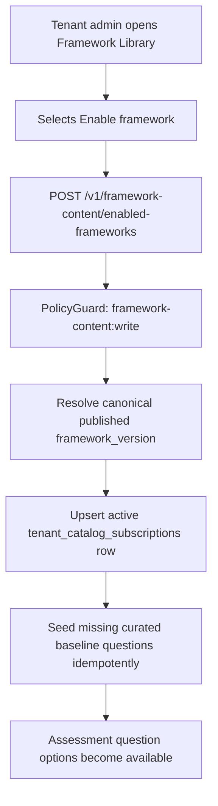
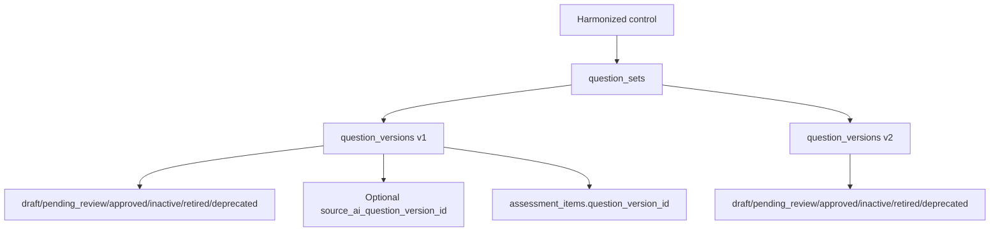
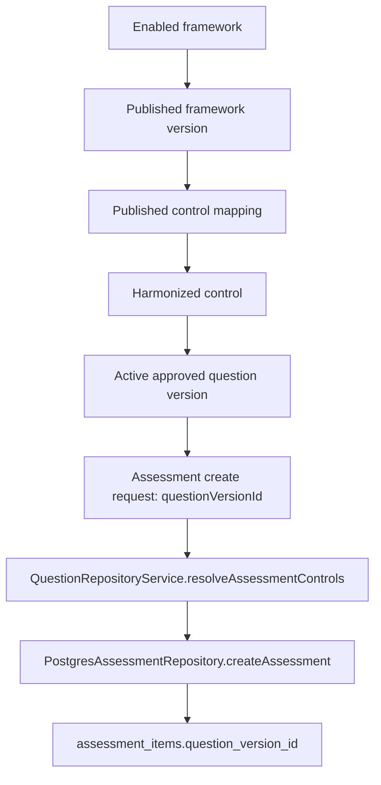

# Question Repository, Framework Enablement, and Assessment Cutover Implementation Report

Date: 2026-07-11

Workspace: `C:\Users\Sourjya Saha\Desktop\GRC_Tool_V3`

Backend: `cybernara-backend`

Frontend: `cybernara-frontend`

## Executive Summary

The objective was to close the framework enablement and governed question repository gaps identified as F-01, F-02, F-03, and F-10:

| Defect | Status | Resolution |
| --- | --- | --- |
| F-01 Framework enablement not built | Resolved | Added tenant framework enablement through `tenant_catalog_subscriptions`, backend endpoints, and Framework Library UI enable action. |
| F-02 Assessment creation used free-text framework/control IDs | Resolved | Assessment creation now selects from approved question options derived from enabled framework subscriptions and catalog mappings. |
| F-03 AI publish and assessment question repository were disconnected | Resolved | Successful AI question publish now promotes the approved AI question into `question_versions` through the governed repository. |
| F-10 `question_versions` lifecycle was inert for assessment-created rows | Resolved for new assessments | New assessments consume existing approved `question_versions`; assessment creation no longer creates placeholder `question_sets` or `question_versions`. |

One requirement was not fully completed as originally worded:

| Requirement | Status | Reason |
| --- | --- | --- |
| Platform Super Admin AI-assisted bulk repository generation that calls the existing OpenAI drafting pipeline and submits generated drafts for review | Not completed | Implemented idempotent curated baseline seeding and AI publish-to-repository integration. A new platform-level bulk OpenAI drafting workflow was not added. This remains a product/backend workflow item. |

Historical assessment/question rows produced before this change were not rewritten. They remain readable as historical data. New assessment creation now rejects missing or unresolved approved question versions.

## Architecture Changes

### Framework Enablement Architecture

Framework enablement now uses the existing `tenant_catalog_subscriptions` table as the tenant subscription record. A tenant enables a published framework version by selecting a published content pack in the Framework Library UI. The backend resolves the selected canonical framework version to its `framework_id` and `source_package_id`, then creates or reuses an active subscription.

Key implementation:

- `QuestionRepositoryService.enableFramework(...)`
- `GET /v1/framework-content/enabled-frameworks`
- `POST /v1/framework-content/enabled-frameworks`
- Frontend action: `app/frameworks/actions/route.ts`
- Frontend UI: `app/frameworks/page.tsx`



### Question Repository Architecture

The repository uses the existing schema hierarchy:

```text
Harmonized Control
  -> Question Set
    -> Question Versions
```

No second repository or duplicate catalog table was introduced. The new `QuestionRepositoryService` centralizes all writes to `question_sets` and `question_versions`.

Repository source types now supported:

- Curated baseline questions generated from existing harmonized control and framework mapping data.
- AI-generated questions after the existing human review and publish gates pass.
- Manual platform-super-admin draft questions created in the platform repository UI.



### Assessment Creation Workflow

Before this change, assessment creation accepted free-text framework/control identifiers and generated placeholder question records. That path is removed.

New workflow:

1. Tenant enables a framework.
2. Backend resolves enabled subscriptions to published framework versions.
3. Backend joins published mappings to harmonized controls and approved active question versions.
4. Frontend displays approved question options.
5. Assessment creation submits `questionVersionId`.
6. Backend resolves that ID to a full `PinnedControlRef`.
7. `assessment_items.question_version_id` references the existing approved question version.



### AI Question Publication Integration

The existing AI generation, human review, and publish gates were not weakened. `AiOrchestrationService.publishQuestion(...)` still requires:

- AI question state is `approved`.
- Generation status is `approved`.
- `approvedBy` is set.

After those existing checks pass, the service now calls `QuestionRepositoryService.publishAiQuestion(...)`, which writes an approved repository `question_versions` row with:

- Actual question text.
- Response type.
- Evidence expectation IDs.
- Citations.
- Confidence.
- `source_ai_question_version_id`.
- Generation run ID inside payload.

### Authorization Model

Tenant framework and assessment paths use the existing policy model:

```text
Role -> Scope -> Clearance
```

Global question repository management is not tenant-scoped. It uses the existing cross-tenant platform operator mechanism:

- `PlatformOperatorGuard`
- `platform_operators.platform_role = 'super_admin'`
- Request context headers `x-user-id` and `x-platform-role: super_admin`

Tenant-scoped `platform_admin` users are explicitly rejected from global question repository endpoints.

### Repository Management Workflow

The platform repository API and UI support:

- Browse question entries.
- Search by text/control.
- Filter by status.
- Create manual draft.
- Approve draft/pending question version.
- Deactivate approved question version.
- Retire question version.
- Restore inactive/retired/deprecated question version to approved.
- View consumers.
- Compare versions in a question set.
- Seed curated baseline questions idempotently.

Not implemented:

- Inline edit draft UI.
- Reject UI.
- Create new version from existing version UI.
- Platform bulk OpenAI drafting workflow.

### Bulk AI Repository Population Workflow

Implemented:

- Idempotent curated baseline seeding via `POST /v1/platform/question-repository/baseline-generation`.
- Existing tenant `/ai` OpenAI generation can create AI-origin questions.
- Existing human review and publish flow promotes approved AI questions into the repository.

Not implemented:

- A platform-super-admin-only bulk OpenAI drafting job that scans all controls and creates AI draft questions for review. This would require orchestration over the existing `AiOrchestrationService.requestGeneration(...)` path, tenant/platform context decisions, batching, idempotency keys per harmonized control, and review queue UX.

## Database Changes

### Migration: `supabase/migrations/0042_question_repository_lifecycle.sql`

| Item | Details |
| --- | --- |
| Purpose | Complete governed question repository lifecycle support by allowing lifecycle status changes without mutating approved payload/provenance fields. |
| Tables created | None. |
| Tables modified | `question_versions`, `tenant_catalog_subscriptions`. |
| Columns added | None. |
| Columns removed | None. |
| Constraints | Replaced `question_versions_status_check` to allow `draft`, `pending_review`, `approved`, `rejected`, `deprecated`, `inactive`, `retired`. Added with `NOT VALID`, then `VALIDATE CONSTRAINT`. |
| Trigger/function changes | Replaced `prevent_approved_question_version_mutation()` so approved payload/provenance remains immutable while status/updated fields can change. |
| Foreign keys | None added. |
| Indexes | `idx_question_versions_source_ai`; `idx_question_versions_status_lifecycle`; partial unique `idx_tenant_catalog_subscriptions_active_version`. |
| RLS policy changes | None. Existing RLS remains in force. |
| Data migration/backfill | No destructive data migration. Historical rows remain as-is. Curated baselines are seeded idempotently by application service, not a migration. |
| Rollback considerations | Drop the three indexes, restore the previous status check, and restore the stricter trigger if status-only lifecycle updates should again be blocked. Existing status values `inactive`, `retired`, or `deprecated` would need reconciliation before restoring the old check. |

Applied in this session:

```text
node scripts/migrate.mjs
Applying 0042_question_repository_lifecycle.sql...
Applied 0042_question_repository_lifecycle.sql.
```

## Backend Changes

| File | Change Summary |
| --- | --- |
| `supabase/migrations/0042_question_repository_lifecycle.sql` | Added lifecycle migration for question versions and active framework subscription uniqueness. |
| `src/modules/assessment/application/question-repository.service.ts` | New core service for framework enablement, approved question option resolution, AI publish promotion, global repository browsing/lifecycle, consumers, and curated baseline seeding. |
| `src/modules/assessment/presentation/question-repository.controller.ts` | New platform-super-admin-only controller for global question repository management. |
| `src/modules/assessment/assessment.module.ts` | Registered `QuestionRepositoryService` and `QuestionRepositoryController`; imported identity platform guard dependencies. |
| `src/modules/assessment/public.ts` | Exported `QuestionRepositoryService` and repository/selection types for other modules and tests. |
| `src/modules/assessment/application/assessment.service.ts` | Added `QuestionRepositoryService` dependency and resolves submitted selections into approved pinned controls before create. |
| `src/modules/assessment/application/assessment.types.ts` | Changed assessment create controls to repository selection type. |
| `src/modules/assessment/domain/assessment.ts` | Added optional `questionVersionId` to `PinnedControlRef` for traceability and historical compatibility. |
| `src/modules/assessment/infrastructure/postgres-assessment.repository.ts` | Removed assessment-time `question_sets`/`question_versions` fabrication; now requires and persists existing `question_version_id`. |
| `src/modules/assessment/presentation/assessment.controller.ts` | Updated create DTO to require `questionVersionId` for new assessment control selection. |
| `src/modules/framework-content/presentation/framework-content.controller.ts` | Added enabled framework list/create endpoints and approved question options endpoint. |
| `src/modules/framework-content/framework-content.module.ts` | Imported assessment module so framework content endpoints can use question repository service. |
| `src/modules/framework-content/public.ts` | Adjusted public exports used by framework update/harmonization code. |
| `src/modules/ai-orchestration/application/ai-orchestration.service.ts` | Extended successful `publishQuestion()` to promote approved AI questions into governed repository; approval gate unchanged. |
| `src/modules/ai-orchestration/ai-orchestration.module.ts` | Imported assessment module to inject question repository service. |
| `src/modules/identity-tenant/identity-tenant.module.ts` | Exported platform operator guard support needed by repository controller. |
| `src/modules/identity-tenant/public.ts` | Publicly exported platform operator guard/context helpers. |
| `src/modules/identity-tenant/application/admin-role-catalog.ts` | Added tenant question repository read/write scopes to tenant roles where appropriate. |
| `src/modules/platform-hardening/domain/hardening.ts` | Added `question_version` classification baseline. |
| `src/modules/framework-update/infrastructure/postgres-framework-update.repository.ts` | Adjusted canonical catalog imports through public module boundary. |
| `src/modules/harmonization/application/harmonization.service.ts` | Adjusted canonical catalog imports through public module boundary. |
| `scripts/openapi-spec.mjs` | Added/modified contract definitions for framework enablement, question options, repository management, and assessment create control shape. |
| `openapi/cybernara.openapi.json` | Regenerated OpenAPI contract. |
| `test/assessment/question-repository-cutover.test.ts` | New integration test proving enablement, question option resolution, and assessment creation without question fabrication. |
| `test/assessment/question-repository-platform-api.test.ts` | New HTTP test proving platform super-admin repository access, tenant-admin rejection, lifecycle actions, and idempotent baseline seeding. |
| `test/helpers/question-repository-fixture.ts` | New test helper to seed/resolve approved question versions for tests that create real assessments. |
| `test/assessment/a2-assessment-api.test.ts` | Updated old assessment tests to use approved repository questions instead of deprecated placeholders. |
| `test/evidence-risk/a3-evidence-risk-api.test.ts` | Updated assessment fixtures in evidence/risk flows to use approved repository questions. |
| `test/platform-hardening/rls-defense-in-depth.test.ts` | Updated assessment fixture setup to use approved repository questions while preserving RLS assertions. |
| `test/reporting-analytics/a4-reporting-api.test.ts` | Updated report assessment fixtures to use approved repository questions. |
| `test/reporting-analytics/g04-report-immutability.test.ts` | Updated report immutability HTTP fixture to use approved repository questions. |

### Public API Changes

New backend endpoints:

| Method | Path | Authorization |
| --- | --- | --- |
| `GET` | `/v1/framework-content/enabled-frameworks` | `PolicyGuard`, `framework-content:read` |
| `POST` | `/v1/framework-content/enabled-frameworks` | `PolicyGuard`, `framework-content:write` |
| `GET` | `/v1/framework-content/question-options` | `PolicyGuard`, `question_version:read` |
| `GET` | `/v1/platform/question-repository/questions` | `PlatformOperatorGuard` |
| `POST` | `/v1/platform/question-repository/questions` | `PlatformOperatorGuard` |
| `POST` | `/v1/platform/question-repository/questions/{questionVersionId}/approve` | `PlatformOperatorGuard` |
| `POST` | `/v1/platform/question-repository/questions/{questionVersionId}/status` | `PlatformOperatorGuard` |
| `GET` | `/v1/platform/question-repository/questions/{questionVersionId}/consumers` | `PlatformOperatorGuard` |
| `GET` | `/v1/platform/question-repository/question-sets/{questionSetId}/versions` | `PlatformOperatorGuard` |
| `POST` | `/v1/platform/question-repository/baseline-generation` | `PlatformOperatorGuard` |

Modified endpoint:

| Method | Path | Change |
| --- | --- | --- |
| `POST` | `/v1/assessments` | `controls[]` now resolves approved repository selections; frontend submits `questionVersionId`. |

## Frontend Changes

| File | Change Summary |
| --- | --- |
| `app/frameworks/page.tsx` | Added enabled framework section and real Enable framework action. Removed visible pack UUID filtering. Requirements are viewed by framework key. |
| `app/frameworks/actions/route.ts` | New server action route that calls `enableFramework` and revalidates framework/assessment pages. |
| `app/assessments/page.tsx` | Replaced free-text internal identifiers with approved question dropdown populated from `listAssessmentQuestionOptions`. |
| `app/assessments/actions/route.ts` | Assessment create action now submits `questionVersionId` only for controls. |
| `app/platform/questions/page.tsx` | New platform question repository page with browse/search/filter/create draft/approve/deactivate/restore/retire/inspect. |
| `app/platform/questions/actions/route.ts` | New platform server actions for baseline seeding, manual draft creation, approval, and lifecycle status updates. |
| `src/lib/api/generated.ts` | Regenerated frontend API client from OpenAPI. |
| `src/lib/navigation.ts` | Added platform navigation item for Question Repository. |

### UI/UX Changes

- Framework Library now has a real enablement action instead of read-only/pin-only behavior.
- Assessment page no longer exposes framework hash/version/control IDs as free-text inputs.
- Platform Question Repository is separate from tenant admin UI and visible only for platform sessions.
- Question lifecycle actions are exposed as explicit buttons on repository rows.

## Question Repository Details

### Repository Hierarchy

```text
Harmonized control
  -> question_sets.control_id
    -> question_versions.question_set_id
      -> assessment_items.question_version_id
```

### Question Set Lifecycle

Question sets group related versions for a harmonized control and a source-specific key, such as:

- `baseline:<harmonizedControlId>`
- `ai:<harmonizedControlId>:<responseType>`
- `manual:<harmonizedControlId>`

`upsertQuestionSet(...)` reactivates an existing set or creates it if missing.

### Question Version Lifecycle

Supported statuses:

```text
draft, pending_review, approved, rejected, deprecated, inactive, retired
```

Approved payload/provenance fields remain immutable. Lifecycle status changes are allowed by migration `0042_question_repository_lifecycle.sql`.

### Curated Questions

Curated baseline questions are seeded from published mappings and harmonized controls. Seeding is idempotent: if an approved baseline question already exists for a harmonized control, it is skipped.

### AI-Generated Questions

AI-generated questions are created by the existing `/ai` flow. Only after human approval and successful publish does the question get copied into the global repository as an approved `question_versions` row.

### Manual Questions

Platform super-admin can create manual draft questions through `/platform/questions`. Drafts can be approved and then used by future assessments if they resolve through enabled framework mappings.

### Versioning Strategy

Assessment creation selects active approved question versions. The current automatic selection in `listAssessmentQuestionOptions` orders by approved timestamp/created timestamp and returns latest approved rows. Explicit user choice is supported by selecting a concrete `questionVersionId`.

### Soft Delete and Retirement Strategy

Lifecycle states are status-only:

- `inactive`: not selected by future assessment creation.
- `retired`: preserved for history, not selected for future assessment creation.
- `deprecated`: preserved for history, not selected for future assessment creation.
- `approved`: eligible for future assessment selection.

No physical deletion is performed by the repository lifecycle endpoints.

### Historical Preservation

Historical assessment items store `assessment_items.question_version_id`. Existing assessments continue to reference their original question version. This implementation does not rewrite old fabricated rows.

## Framework Enablement Details

### Tenant Subscription Flow

1. UI submits hidden `frameworkVersionId` from a selected published content pack.
2. Backend resolves the canonical framework version.
3. Backend writes active `tenant_catalog_subscriptions` row for `(tenant_id, framework_id, source_package_id)`.
4. Backend seeds curated baselines for that framework version.
5. Assessment create UI reads approved question options for tenant-enabled frameworks.

### Mapping Resolution

Question options are resolved through:

```text
tenant_catalog_subscriptions
  -> framework_versions/source_package_id
  -> frameworks
  -> controls
  -> control_mappings
  -> harmonized_controls
  -> question_sets
  -> approved question_versions
```

The implementation handles mappings where child source control IDs start with a parent control key.

## Authorization Changes

### New Roles

No new tenant roles were introduced.

### New Scopes

| Scope | Purpose |
| --- | --- |
| `question_version:read` | Allows tenant users to read approved question options for assessment creation. |
| `question_version:write` | Reserved for tenant-level question-version permissions in role catalog; global repository management is still platform-super-admin only. |

### Clearance Rules

| Resource | Classification |
| --- | --- |
| `question_version` | `confidential` |

Framework content remains classified according to existing `framework-content` rules.

### Platform Super Admin Permissions

Global question repository management uses `PlatformOperatorGuard`, not tenant `PolicyGuard`. The guard checks an active `platform_operators` row with `platform_role = 'super_admin'`. This prevents tenant-scoped platform admins from managing the shared global repository.

### Tenant Permissions

| Endpoint | Tenant Permission |
| --- | --- |
| `GET /v1/framework-content/enabled-frameworks` | `framework-content:read` |
| `POST /v1/framework-content/enabled-frameworks` | `framework-content:write` |
| `GET /v1/framework-content/question-options` | `question_version:read` |
| `POST /v1/assessments` | `assessment:write` plus approved question resolution |

## OpenAPI Changes

### New Request/Response Models

- `EnableFrameworkRequest`
- `FrameworkEnablement`
- `AssessmentQuestionOption`
- `QuestionRepositoryEntry`
- `QuestionRepositoryStatus`
- `QuestionRepositoryResponseType`
- `CreateQuestionRepositoryDraftRequest`
- `UpdateQuestionRepositoryStatusRequest`
- `QuestionRepositoryConsumers`
- `PopulateQuestionRepositoryBaselineRequest`
- `QuestionRepositoryPopulateResult`

### Modified Models

- `PinnedControlRef` includes `questionVersionId`.
- Assessment create controls now align with repository selection rather than arbitrary free-text internal IDs.

### Generated Client

Frontend client was regenerated with:

```text
npm run contract:generate
Generated API client from C:\Users\Sourjya Saha\Desktop\GRC_Tool_V3\cybernara-backend\openapi\cybernara.openapi.json
```

## Testing Evidence

### Migration

| Command | Result |
| --- | --- |
| `node scripts/migrate.mjs` | Passed. Applied `0042_question_repository_lifecycle.sql`. |

Output:

```text
Applying 0042_question_repository_lifecycle.sql...
Applied 0042_question_repository_lifecycle.sql.
```

### OpenAPI Generation and Currency

| Command | Result |
| --- | --- |
| `npm run openapi:generate` | Passed. Generated backend OpenAPI JSON. |
| `npm run contract:generate` in frontend | Passed. Regenerated frontend client. |
| `npm run openapi:check` | Passed. Contract current. |

Output:

```text
Generated OpenAPI contract at openapi/cybernara.openapi.json
Generated API client from C:\Users\Sourjya Saha\Desktop\GRC_Tool_V3\cybernara-backend\openapi\cybernara.openapi.json
OpenAPI contract is current.
```

### Focused Repository and AI Tests

| Command | Result | Summary |
| --- | --- | --- |
| `npx vitest run test/ai-orchestration/a5-ai-api.test.ts test/assessment/question-repository-cutover.test.ts` | Passed after SQL CTE fix | 2 files, 11 tests passed. |
| `npx vitest run test/assessment/question-repository-platform-api.test.ts test/assessment/question-repository-cutover.test.ts test/ai-orchestration/a5-ai-api.test.ts` | Passed after migration apply | 3 files, 13 tests passed. |

Output:

```text
Test Files  3 passed (3)
Tests       13 passed (13)
```

### Previously Failing Regression Suites

Initial full unit run exposed old tests still using the removed placeholder path:

```text
Test Files  5 failed | 46 passed (51)
Tests       14 failed | 575 passed (589)
```

After updating those fixtures to use approved repository questions:

| Command | Result | Summary |
| --- | --- | --- |
| `npx vitest run test/assessment/a2-assessment-api.test.ts test/evidence-risk/a3-evidence-risk-api.test.ts test/platform-hardening/rls-defense-in-depth.test.ts test/reporting-analytics/a4-reporting-api.test.ts test/reporting-analytics/g04-report-immutability.test.ts` | Passed | 5 files, 29 tests passed. |
| `npx vitest run test/assessment/a2-assessment-api.test.ts` | Passed after timeout update | 1 file, 6 tests passed. |

Output:

```text
Test Files  5 passed (5)
Tests       29 passed (29)

Test Files  1 passed (1)
Tests       6 passed (6)
```

### Full Backend Gate

| Command | Result | Summary |
| --- | --- | --- |
| `npm run test` | Passed | Lint, typecheck, unit/integration, architecture, migration lint, OpenAPI check. |

Output:

```text
Test Files  51 passed (51)
Tests       589 passed (589)
Architecture boundary check passed.
Migration convention check passed.
OpenAPI contract is current.
```

### Backend Typecheck, Lint, Architecture, Migration Lint

These were also run independently during implementation:

```text
npm run typecheck
tsc --noEmit

npm run lint
eslint .

npm run arch:test
Architecture boundary check passed.

npm run migration:lint
Migration convention check passed.
```

### Frontend Verification

| Command | Result | Summary |
| --- | --- | --- |
| `npm run typecheck` | Passed | `tsc --noEmit`. |
| `npm run lint` | Passed | `eslint .`. |
| `npm run build` | Initially failed | Windows EPERM on `.next\trace` because dev server held generated artifact. |
| Clean `.next`, restart build | Passed | Next build and performance budget passed. |

Final output:

```text
✓ Compiled successfully
✓ Generating static pages (38/38)
Performance budget passed for 10 interactive routes.
```

Frontend dev server was restarted and checked:

```text
GET http://127.0.0.1:3001 -> 200
```

### Playwright Tests

No Playwright test suite was run in this implementation session. Verification for the changed frontend routes was by typecheck, lint, production build, and backend HTTP integration tests. This is a remaining verification gap for browser-level behavior of the new Platform Question Repository page.

### RLS Tests

RLS was covered by the full backend gate:

```text
test/platform-hardening/rls-matrix.test.ts
187 tests passed
```

Defense-in-depth application repository RLS tests also passed:

```text
test/platform-hardening/rls-defense-in-depth.test.ts
2 tests passed
```

### Authorization Tests

New platform repository authorization evidence:

```text
test/assessment/question-repository-platform-api.test.ts
Platform question repository API > rejects tenant-scoped admins from global repository endpoints
Platform question repository API > allows platform super-admin lifecycle actions and idempotent baseline generation
2 tests passed
```

Existing clearance/policy evidence from full backend gate:

```text
test/platform-hardening/policy-classification-http.test.ts
6 tests passed
```

No separate per-endpoint wrong-role/wrong-clearance tests were added for `POST /v1/framework-content/enabled-frameworks`. That endpoint is guarded by existing `PolicyGuard` metadata and covered indirectly through the full policy infrastructure tests.

## Before vs After

| Area | Before | After |
| --- | --- | --- |
| Framework enablement | No tenant enablement write/read flow. Framework Library was effectively read-only/pin-only. | Tenant can enable a published framework. Active subscription drives assessment question availability. |
| Assessment creation | User/front-end supplied free-text framework/control identifiers and a generated placeholder question string. Backend accepted arbitrary strings. | Frontend selects approved question options. Backend resolves `questionVersionId` against enabled framework mappings and approved repository rows. |
| Question repository | `question_sets`/`question_versions` existed but assessment creation bypassed governance by fabricating rows. | Repository is the single source consumed by new assessments. Assessment creation no longer writes question tables. |
| AI integration | AI publish wrote publication/outbox evidence only; assessment creation could not consume AI questions. | Successful AI publish promotes approved AI question into repository with content, citations, evidence expectations, confidence, and AI source link. |
| Authorization | Tenant framework enablement and global repository management did not exist. | Tenant enablement uses `PolicyGuard`; global repository management uses `PlatformOperatorGuard`. |
| User workflow | User had to type internal IDs/hashes and still got placeholder question records. | User enables framework, selects approved question, creates assessment with traceable approved question version. |

## Remaining Limitations

1. Platform bulk OpenAI repository drafting is not implemented.
   - Why: The session implemented curated baseline seeding and AI publish promotion, but not a new platform-super-admin batch job over the OpenAI generation pipeline.
   - What remains: A platform job that enumerates harmonized controls without suitable approved questions, calls `AiOrchestrationService.requestGeneration(...)`, stores generated draft questions in the existing review queue, and requires human approval/publish.
   - Required work: Batch orchestration, idempotency keys per control, platform UI progress/history, review queue integration, tests proving no governance bypass.

2. Draft edit/reject/new-version UI is not implemented.
   - Why: The implemented platform UI covers create draft, approve, deactivate, retire, restore, inspect, consumers, and version comparison.
   - What remains: Edit draft form, reject action, create-new-version-from-existing action.
   - Required work: Backend endpoints for edit/reject/new-version if not already exposed, OpenAPI updates, UI controls, tests.

3. Playwright coverage was not run for the new pages.
   - Why: Verification in this session focused on backend correctness, generated contracts, frontend compile/build, and HTTP integration.
   - What remains: Browser tests for Framework Library enable action, assessment approved-question selection, and `/platform/questions` lifecycle actions.

4. Existing historical fabricated rows are not reconciled.
   - Why: Historical immutability was preserved intentionally.
   - What remains: Optional one-time reconciliation if product decides old assessments must be mapped to approved repository rows.

## Final Verification Checklist

| Check | Status | Evidence |
| --- | --- | --- |
| Framework Enablement implemented | Complete | `POST/GET /v1/framework-content/enabled-frameworks`, Framework Library UI action, focused cutover test. |
| Assessment Creation uses enabled frameworks | Complete | `QuestionRepositoryService.resolveAssessmentControls`, cutover test. |
| Assessment Creation consumes approved Question Versions | Complete | `assessment_items.question_version_id` assertion in cutover test. |
| No fabricated question records remain in new assessment creation | Complete | `PostgresAssessmentRepository.createAssessment` rejects missing `questionVersionId`; full tests updated to real repository questions. |
| Question Repository operational | Partially complete | Browse/search/create draft/approve/status/consumers/version compare/baseline seed implemented; edit/reject/new version UI deferred. |
| AI publish writes into Question Repository | Complete | `AiOrchestrationService.publishQuestion` calls `QuestionRepositoryService.publishAiQuestion`; A5 tests pass. |
| Platform Super Admin repository management implemented | Partially complete | Platform-super-admin API/UI for implemented lifecycle subset; tenant admin rejection test passes. |
| AI bulk repository generation implemented | Not complete | Curated baseline seeding implemented; platform bulk OpenAI drafting not implemented. |
| RBAC enforced | Complete for tenant endpoints via existing PolicyGuard and platform endpoints via PlatformOperatorGuard | Full backend gate plus platform repository authorization test. |
| Scope enforcement verified | Partially complete | Full policy tests and endpoint metadata; no new per-endpoint wrong-scope test for framework enablement. |
| Clearance enforcement verified | Complete through existing policy-classification tests | `test/platform-hardening/policy-classification-http.test.ts` passed in full gate. |
| OpenAPI updated | Complete | `npm run openapi:check` passed. |
| Frontend regenerated | Complete | `npm run contract:generate` passed. |
| Tests passed | Complete for backend and frontend build | Backend `npm run test`: 589 passed. Frontend build passed. |
| Historical assessments remain valid | Intended/partially verified | Domain keeps `questionVersionId` optional for historical records; no destructive migration. No dedicated historical browser test added. |

